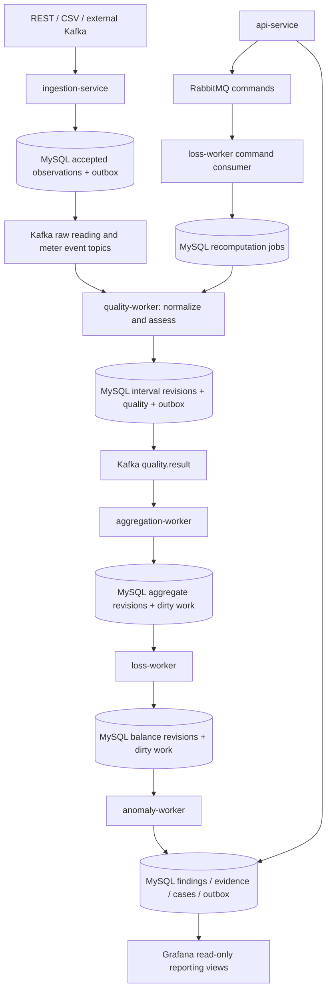

# OpenGrid Loss — production implementation design

Status: proposed design, not an implemented or deployment-validated system.

This design consolidates both supplied briefs. The measurement correction takes precedence over the original field names. The result is an open-source energy-accounting and anomaly-investigation platform. Its outputs describe observations and investigation candidates; they never assert theft.

## 1. Architectural decisions

| Concern | Decision |
|---|---|
| Deployment | One Linux host, Docker Compose; Windows development through Docker Desktop/WSL2 or native Python |
| Application | Python 3.12+, FastAPI, Pydantic 2, SQLAlchemy 2, Alembic |
| Persistence | MySQL 8.4 family, InnoDB; exact supported patch and image digests pinned during implementation |
| Streaming | Apache Kafka in KRaft mode, at-least-once delivery with idempotent database effects |
| Commands | RabbitMQ, durable jobs, publisher confirms and manual consumer acknowledgements |
| Interface | Grafana OSS for analysis; FastAPI JSON and small server-rendered investigation forms |
| Code organization | One installable domain/application package, six thin service entry points |
| Arithmetic | Decimal throughout energy calculations; explicit units and rounding |
| Raw data | Immutable observations and explicit corrections; never overwrite registers with interval values |
| Time | UTC instants, half-open intervals, event-time accounting |
| Reliability | Transactional inbox/outbox, revisioned projections, scheduled reconciliation |
| Availability | Restartable single-host deployment; host failure remains a full-service outage |

Kafka transactions alone do not make MySQL writes exactly once. Coordinate each worker's inbox, domain changes and outbox in one MySQL transaction, then commit the Kafka position. This follows the external-system boundary described in [Kafka delivery semantics](https://kafka.apache.org/41/design/design/).

## 2. Service ownership and flow



Each owning service relays its own outbox. No additional relay microservice is necessary. Worker loops for different responsibilities run with separate sessions and bounded resources.

| Service | Responsibilities | Does not own |
|---|---|---|
| api-service | Metadata, effective-date changes, reporting, case workflow, command submission | Raw normalization or calculation logic |
| ingestion-service | REST/CSV/source-Kafka adapters, envelope validation, durable acceptance, raw-event publishing | Inferred interval energy |
| quality-worker | Persist meter events; normalize meter and transformer energy; maintain quality and lineage; process interval recomputation jobs | Transformer balance decisions |
| aggregation-worker | As-of topology membership, expected population, current valid contributions, aggregation deadlines | Anomaly scoring |
| loss-worker | Balance revisions, RabbitMQ command dispatch to durable jobs, reconciliation scheduling | Human case outcomes |
| anomaly-worker | Historical baselines, persistence, consumption deviations, correlation, immutable findings, case creation | Metadata changes |

The API gateway routes `/api/v1/readings/*` directly to ingestion. Both HTTP services reuse authentication and schemas. The event-worker box in the original diagram is folded into quality-worker.

Aggregation consumes validated interval-change events, not raw readings. Otherwise it can race quality validation and sum cumulative registers. Meter and transformer normalization share the same tested engine.

## 3. Measurement contract

Use a discriminated union with `measurement_kind = CUMULATIVE_REGISTER | INTERVAL_ENERGY`. Reject ambiguous legacy `energy_import_kwh` input. Do not silently infer semantics from magnitude.

Common fields:

| Field | Rule |
|---|---|
| event_id | UUID; stable across retries |
| schema_version | Explicit supported integer; incompatible changes use a new version |
| entity_kind | METER or TRANSFORMER |
| entity_code | Stable external code, resolved to an internal numeric FK |
| source_id | Registered source identity; caller authorization must permit it |
| source_revision | Monotonic correction revision for a natural observation key |
| event_time | Measurement occurrence/boundary time, never ingestion time |
| received_at | Collector receipt time, when supplied and trusted |
| ingested_at | Server acceptance time |
| processed_at | Worker processing time on derived records |
| unit_system | SI; adapter performs explicit conversion before acceptance |
| energy_basis | REGISTER_SECONDARY or PRIMARY; determines whether scaling is needed |
| register_epoch | Installation/register identity; prevents deltas across replacement/reset boundaries |

Cumulative payload: `reading_time`, `import_energy_total_kwh`, optional `export_energy_total_kwh`. Instantaneous `import_power_kw` is telemetry only. If power is an interval average, use `avg_import_power_kw` and its explicit interval. Neither replaces energy in accounting.

Interval payload: `interval_start`, `interval_end`, `import_energy_kwh`, optional `export_energy_kwh`. Raw supplied interval energy and normalized interval energy live in different layers, even though their units match.

Serialize Decimal quantities as JSON strings, for example `"12543.842000"`. Require finite bounded values, nonnegative import/export channels, and an explicit supported precision. Reject timezone-naive timestamps. Normalize aware timestamps to UTC before persistence. In MySQL use `DATETIME(6)` with UTC session settings and a SQLAlchemy type adapter that strips/reinstates UTC deliberately.

MVP accepts aligned 15-minute intervals and boundary register readings. Reject unsupported durations with a clear reason. `INTERVAL_MINUTES` is a deployment-wide policy, initially validated as 15; adding 5/30/60 later requires corresponding aggregation and test support, not merely changing an environment variable.

## 4. Normalization and quality

For a register pair at exactly the two interval boundaries:

```text
reported_delta = register(end) - register(start)
primary_energy_kwh = reported_delta × effective_multiplier
average_power_kw = primary_energy_kwh / (duration_seconds / 3600)
```

Apply the multiplier once, only to secondary measurements. PRIMARY observations have scale 1. Resolve the multiplier and register configuration as of the interval; keep their configuration IDs in lineage.

Rules in order:

1. Resolve entity, source, installation epoch, topology and measurement policy.
2. Validate timestamps, alignment, finite values and bounds. Future skew is configurable; quarantine excessive skew.
3. Require exact boundary readings in the same epoch. A 30-minute gap does not yield two assumed 15-minute values.
4. A replacement, reset or multiplier change inside an interval makes that interval unusable unless sufficient explicitly segmented observations exist. MVP marks it invalid for accounting.
5. A negative delta is not automatically a rollover. With configured register modulus, explicit rollover evidence and a physical plausibility bound, compute `modulus - previous + current`. Distinguish modulus from highest displayable value. Without sufficient evidence, return REGISTER_RESET or INVALID with a reason.
6. Check maximum plausible energy using configured maximum power and interval duration. Sanctioned load alone is not a reliable hard physical limit. Missing limits reduce confidence in rollover classification.
7. Independently normalize import and export. Absent export is unknown unless an effective capability policy explicitly establishes import-only measurement.
8. Round normalized stored energy once to six decimal places using the documented rounding mode. Retain raw precision, calculation version and scaling policy.

Use separate fields for `calculation_status`, a set of `quality_flags`, and `reason_codes`. LATE and OUT_OF_ORDER can coexist with a usable interval. DUPLICATE is a delivery observation, not a reason to invalidate previously accepted energy. INVALID, MISSING, REGISTER_RESET, REGISTER_ROLLOVER, METER_REPLACED and ESTIMATED retain their distinct meanings. ESTIMATED energy is excluded from detection by default.

For two available representations of the same interval, a versioned source policy chooses the authoritative one. Record and compare the other as corroboration; never sum both. A disagreement beyond tolerance creates a quality issue.

### Late readings and correction propagation

Inserting or correcting the reading at boundary `t` schedules `[t−15m,t)` and `[t,t+15m)` for recomputation. A change of epoch, policy or topology schedules every affected interval. Recompute from accepted observations, not delivery order.

A corrected interval invalidates its aggregate, balance and dependent findings. A changed historical balance may affect comparable baseline slots in the next 28 days. Re-evaluate those slots and their following persistence windows; meter rolling statistics require their corresponding 7/28-day dependency ranges. Record the complete dependency range in a durable job.

Retain prior results as revisions. Mark obsolete findings superseded; retain their evidence and any human case decisions. Never silently rewrite the evidence on which a user acted.

## 5. MySQL logical model

Use BIGINT internal IDs, unique external codes, decimal energy, UTC microseconds, explicit FKs and named constraints. Separate human-readable codes from numeric IDs in API names. UUID transport IDs can be BINARY(16) internally with conversion at the repository boundary.

| Table family | Important columns and constraints |
|---|---|
| feeder, transformer, meter | Unique codes; metadata, active status, created/updated times; transformer→feeder FK |
| meter_installation | Meter FK, register epoch, installed/removed times; immutable historical installation identity |
| meter_transformer_assignment | Meter FK, transformer FK, valid_from, valid_to, revision; effective membership |
| measurement_configuration | Entity FK through typed owner tables, valid range, multiplier, energy basis, modulus, export capability, source precedence, max power, version |
| accepted_observation | Event UUID unique; payload hash; source; typed entity reference; schema version; accepted time; immutable payload |
| meter_reading / transformer_reading | Entity FK, source, boundary time, epoch, source revision; explicit register fields; observation FK; unique natural key plus revision |
| meter_interval_observation / transformer_interval_observation | Explicit supplied interval energy; source revision and observation FK |
| observation_selection | Unique source/entity/epoch/time-or-interval key; points to current accepted revision |
| meter_event | Meter FK, occurrence/receipt times, typed event, source event key unique, immutable evidence |
| meter_interval_energy / transformer_interval_energy | Entity, start/end, revision; import/export energy, average power, validity, source/config lineage, algorithm version; unique entity/start/revision |
| interval_current | Typed separate meter/transformer pointer tables; unique entity/start; FK to current interval revision |
| meter_interval_quality | Entity/start/revision, expected/received/valid indicators, flags, delay, reasons; no fabricated zero energy |
| transformer_interval_aggregate | Transformer/start/revision; expected/received/valid counts, valid import/export sums, topology revision, input fingerprint |
| transformer_energy_balance | Transformer/start/revision, source aggregate and transformer interval FKs, input/downstream/difference, percentage, completeness, confidence, status |
| baseline_snapshot | Entity/slot/time, sample count, median/mean/stddev/MAD, cohort policy, window, algorithm version, input fingerprint |
| anomaly_observation | Typed entity FK, interval, type, calculation revision; unique evaluation key; score components and immutable evidence |
| anomaly_episode | Entity/type, first/last interval, state, distinct occurrence count; groups related observations |
| investigation_case | Unique case_no; episode FK, priority, status, assignee, resolution, optimistic version |
| case_history | Case FK, actor, action, prior/new status, timestamp, evidence revision; append-only |
| inbox | Consumer name + event UUID unique; hash and processed time; transport bookkeeping only |
| outbox | Event UUID unique, destination, partition key, body, next attempt, attempts, lease, published time |
| dirty_interval / processing_job | Unique logical work key, requested/processed generation, lease, attempt state, progress, error |
| quarantined_message | Payload/reference, reason, source coordinates, replay action history |
| system_metric_bucket | Bounded operational time buckets for Grafana system-health panels |

For polymorphic records, use nullable `meter_id` / `transformer_id` with real FKs and a CHECK requiring exactly one, or separate typed tables. Do not use unconstrained `entity_type, entity_id` as the only reference.

Enforce `interval_end > interval_start`, nonnegative channel energies, positive multipliers, valid count ≤ expected count and allowed statuses with CHECK constraints. Register values are nonnegative; signed *net* derived quantities are permitted.

Reject overlapping effective-date assignments/configurations transactionally: lock the owning meter/entity row, query overlaps, then insert. Every writer uses this path. Adjacent `[a,b)` and `[b,c)` assignments are allowed. Metadata edits affecting history must create audited revisions and reprocessing jobs.

Index readings by `(entity_id, reading_time, source_revision)`, intervals and balances by `(entity_id, interval_start, revision)`, time-range retention by timestamp, cases by `(status, priority_score, id)`, and work queues by `(state, next_attempt_at, id)`. Avoid duplicate indexes already covered by a unique key prefix.

Use current-pointer joins or reporting views so dashboards never sum multiple revisions. Preserve as-of references for forensic queries.

Keep FK-backed tables unpartitioned initially. MySQL InnoDB native partitioning is incompatible with foreign keys; a partitioning proposal must explicitly redesign that tradeoff. See [MySQL partitioning restrictions](https://dev.mysql.com/doc/refman/8.4/en/partitioning-limitations-storage-engines.html).

## 6. Acceptance, transactions and concurrency

REST accepts an event only after the observation and raw-topic outbox row commit together. Return `202 Accepted` with event ID and a status URL; this means durably accepted, not calculated.

- Same event ID and same canonical payload hash: return the prior acceptance.
- Same event ID and different hash: return 409 and record a conflict.
- Same natural reading key/revision and same value: deduplicate even with a different event ID.
- Same natural key/revision and different value: quarantine/409. Never last-write-wins an unexplained measurement conflict.
- Higher authorized source revision: append a correction and schedule recomputation. An older revision arriving later cannot displace it.

External Kafka adapters use the same acceptance transaction and commit their source offsets afterward. Bulk REST validates the complete bounded batch before an all-or-nothing acceptance transaction. Default proposed bounds: 1,000 readings and 2 MiB; publish exact limits in OpenAPI. CSV imports stream bounded batches, use deterministic row identities and retain a manifest for resumability.

Each worker transaction:

```text
BEGIN
  claim inbox(consumer_name, event_id); reject hash mismatch
  if already completed: no domain mutation
  otherwise:
    lock the relevant entity/interval state
    read current accepted input revisions
    compute deterministic result
    append revision only if input fingerprint changed
    advance current pointer
    mark downstream work dirty / insert outbox event
COMMIT
commit contiguous completed Kafka offsets
```

Inbox insertion and completion occur in the same transaction. Rollback leaves the event retryable. Process sequentially per partition initially; do not commit beyond an unfinished earlier record. Handle rebalance by stopping intake, finishing or rolling back in-flight work, and releasing ownership safely.

Outbox relays lease rows in a short transaction, publish outside that transaction, wait for broker acknowledgement, and mark sent afterward. Crash after publish may duplicate; consumer inboxes absorb it. Leases expire after crashes. Revisions and canonical database reads protect against out-of-order relay delivery.

For dirty work, increment `requested_generation` atomically. A worker captures generation G and advances `processed_generation` only to G after a successful calculation. A concurrent change to G+1 remains dirty. Never clear a dirty boolean unconditionally.

Lock aggregate state by transformer/interval. Re-read the authoritative contribution set in that transaction; compute a fresh sum. Never implement replay as `total += event.energy`. Start with recomputation of approximately 100 contributions per transformer and coalesce bursts; optimize only after profiling.

## 7. Messaging and recovery

| Topic | Key | Initial partitions | Meaning |
|---|---|---:|---|
| openami.meter.reading | meter code | 6 | Durably accepted raw observations |
| openami.transformer.reading | transformer code | 3 | Durably accepted raw observations |
| openami.meter.event | meter code | 6 | Meter events, not conclusions |
| openami.quality.result | transformer code | 3 | Interval normalization/quality revision notification |
| openami.anomaly | typed entity code | 3 | Created, revised or superseded finding |
| openami.deadletter | source key | 3 | Quarantine notification and durable reference |

Partition counts are configurable at creation. Increasing partitions can change key routing; perform a controlled drain/cutover if application ordering relies on stable mapping. Event-time correctness still comes from stored revisions, not arrival ordering.

Kafka producer: idempotence enabled, `acks=all`, bounded delivery timeout and supported ordering settings. Consumer: auto-commit disabled, explicit group per logical stage, bounded batch size. Single-broker Compose necessarily has replication factor 1 and no broker redundancy. Persistent volumes and backups do not make it highly available.

Distinguish permanent failures from infrastructure outages. Invalid messages go to durable quarantine with an outbox notification before advancing offsets. Transient errors use bounded exponential backoff with jitter; exhausted work becomes a visible FAILED job/quarantine item. During broad database/broker outages pause intake and fail readiness; do not classify every valid message as poisonous. Poll/liveness handling must prevent retries from causing uncontrolled rebalances.

RabbitMQ queues retain the requested names: `openami.calculation`, `openami.reprocessing`, `openami.notification`. Implement only enabled command types; reject unsupported `job_type` values. Persist a job and Rabbit outbox in the API transaction. Publish persistent messages with confirms and mandatory routing; inspect unroutable returns. ACK only after durable job acceptance. Job execution and progress are durable, idempotent and chunked. An ACK lost after commit causes a harmless duplicate.

Publisher confirmation and consumer acknowledgement are independent boundaries, as documented by [RabbitMQ](https://www.rabbitmq.com/docs/confirms). Use bounded retry queues/dead-lettering, not a tight requeue loop.

Reconciliation runs on a database-leased schedule inside loss-worker. It creates expected interval slots from historical membership, marks expired slots missing, finds dirty/orphaned work and reschedules it. This detects an entirely silent transformer even when no messages arrive.

## 8. Energy accounting

Use aligned intervals and a declared electrical boundary. For sites with bidirectional metering:

```text
transformer_net_kwh = transformer_import_kwh − transformer_export_kwh
downstream_net_kwh = Σ(meter_import_kwh − meter_export_kwh)
accounting_difference_kwh = transformer_net_kwh − downstream_net_kwh
accounting_difference_percent = 100 × difference / transformer_net_kwh
```

Only report that percentage when transformer net import exceeds a configured minimum meaningful energy. At zero, near zero or reverse flow, retain the signed kWh difference and a reason, but return a null percentage. Do not clamp negative differences to zero. A transformer lacking export measurement is not eligible for bidirectional accounting without an explicit site policy.

For an import-only site these equations reduce to the original `T − ΣM`. Persist separate import/export/net fields so labels cannot hide their meaning. Explicitly model known unmetered loads later; do not invent a balancing adjustment to make results look normal.

Expected meters are installations assigned for the entire interval under the effective topology. A mid-interval topology change makes the affected comparison topology-incomplete in MVP. No current `meter.active` lookup is allowed to redefine historical denominators.

```text
received_completeness = 100 × received_expected_meters / expected_meters
valid_completeness = 100 × valid_expected_meters / expected_meters
```

Expose both. When expected count is zero, completeness is null with `EMPTY_TOPOLOGY`. When all meters are missing, sum of observed valid energy is zero but the full downstream value is unknown. Store `observed_downstream_energy_kwh` and mark the balance INCOMPLETE; do not display the resulting 100% partial difference as a reliable imbalance.

States: OPEN until interval end plus allowed lateness; PROVISIONAL while inputs are pending; COMPLETE when inputs meet the policy; INCOMPLETE after the deadline if they do not. Proposed allowed lateness is 30 minutes, to be tuned from collector delay distributions. COMPLETE means complete under policy, not immutable. Corrections always produce a new revision.

Dashboard totals use sums over compatible eligible intervals. Portfolio percentage is `100 × Σdifference / Σinput`, not an unweighted average of transformer percentages. Report excluded intervals and coverage alongside it.

## 9. Baselines, detection and explainability

Baseline policy v1: previous 28 days, same transformer and UTC quarter-hour slot, strictly before the evaluated interval. Minimum proposed sample count: 14. Use eligible complete balances; exclude known invalid/estimated observations and material topology/configuration discontinuities. Record exclusions. Show `INSUFFICIENT_HISTORY` rather than assuming a zero baseline.

Calculate median, mean, standard deviation and median absolute deviation. Store sample count, selection policy and window. UTC slots are unambiguous; a later local-seasonality policy must store IANA zone and explicitly handle DST folds/gaps.

Primary deviation is in **percentage points**: `18.7 − 7.2 = 11.5 pp`. Optional relative deviation is `100 × (current − baseline) / max(abs(baseline), baseline_floor)` and must be labeled separately.

Proposed eligibility and trigger defaults, subject to simulation and field calibration:

- Valid completeness at least 98%; valid transformer energy; stable topology; sufficient history; no active broad communication outage.
- Current difference exceeds the median by `max(5 pp, 3 × 1.4826 × MAD)` and exceeds a configured minimum kWh impact.
- At least 4 anomalous slots within the latest 6 adjacent canonical slots, with the current slot anomalous. All six must be eligible in v1; otherwise evidence is insufficient. Never concatenate observations across a time gap.
- Low-quality intervals generate quality/communication findings, not energy-imbalance investigation candidates.

Meter analysis uses primary interval energy, 7/28-day rolling statistics and comparable historical slots. Require a meaningful baseline and enough valid observations before applying the requested `<30%` drop or `>250%` spike thresholds. Flatline uses configured energy tolerance and adjacent eligible intervals; zero consumption means explicit valid zero values, not missing readings. Correlate meter events within a bounded time window and mark correlation as supporting context.

Preserve the requested score weights with versioned normalization:

```text
d = clamp(deviation_pp / configured_full_scale_pp, 0, 1)
p = anomalous_slots / persistence_window_slots
c = valid_completeness_percent / 100
m = abnormal_eligible_meters / max(eligible_meters, 1)
e = clamp(relevant_event_count / configured_event_scale, 0, 1)
score = 35d + 25p + 20c + 10m + 10e
```

Scoring occurs only after eligibility and persistence gates; high completeness alone cannot create an anomaly. Severity bands are unambiguous: `[0,30)` NORMAL, `[30,60)` WATCH, `[60,80)` HIGH, `[80,100]` CRITICAL.

Confidence is a separate evidence-quality index. Proposed version 1: `100 × valid_fraction × transformer_valid × min(history_samples/28,1) × communication_coverage × topology_valid`. Define communication coverage as the fraction of expected meters without an active communication-failure flag in the evaluation window. Store all factors; zeros explain suppression. This conservative index requires calibration and is not a statistical probability.

Priority is separately versioned, for example `0.50×score + 0.25×impact_index + 0.15×duration_index + 0.10×affected_meter_index`, multiplied by confidence/100. Each index is 0–100 with configured saturation values. Sum excess kWh across distinct current eligible interval revisions only; do not multiply the latest interval by occurrence count.

Each finding stores input revision IDs/fingerprint, baseline snapshot, expected/valid counts, component values, thresholds, policy versions, reasons, correlated event IDs, affected meter IDs and evaluation time. Large affected-meter lists belong in a join table with summary counts in JSON.

Group findings into episodes. The same replay cannot increment occurrences twice. An episode closes after a configurable consecutive eligible recovery period; ineligible slots pause recovery. Lock a typed entity/type episode-state row when opening episodes so concurrent workers cannot create duplicate active episodes. Case creation is unique per episode.

## 10. Python boundaries

Use this target package layout; the folders below describe future implementation, not files already generated:

```text
open-grid-loss/
  pyproject.toml
  src/opengrid/
    domain/          # frozen dataclasses, Decimal values, pure algorithms
    application/     # use cases, unit-of-work and repository Protocols
    contracts/       # Pydantic transport models and schema versions
    infrastructure/  # SQLAlchemy mappings, Kafka, RabbitMQ, auth, clocks
    entrypoints/     # api, ingestion, quality, aggregation, loss, anomaly
  services/          # thin deployment entry points / image targets
  database/migrations/
  database/schema.sql
  grafana/{dashboards,provisioning}/
  simulators/
  tests/{unit,integration,contract,e2e}/
  docs/
```

Prefer one installable shared package over six copied `config.py`/model trees. The supplied `libs/` and `algorithms/` concepts map to domain and infrastructure packages. This is an intentional maintainability adjustment to the proposed directory structure.

Pure domain functions include `normalize_register_pair`, `calculate_energy_balance`, `calculate_baseline`, `detect_persistence`, `detect_consumption_deviation`, and `calculate_priority`. Return typed immutable result objects including reason codes. Inject clocks, policy objects and repositories; do not import FastAPI, SQLAlchemy or Kafka into domain algorithms.

Use synchronous SQLAlchemy sessions and synchronous FastAPI handlers for ordinary database operations in MVP. Kafka consumers run dedicated worker processes. Add async only where concurrent I/O provides a measured benefit. Never share sessions across concurrent work; SQLAlchemy specifies [Session per thread and AsyncSession per task](https://docs.sqlalchemy.org/en/20/orm/session_basics.html).

Create engines/pools once per process at startup, sessions per transaction, and dispose cleanly on shutdown. A process-local engine is appropriate; a global mutable Session is not. Keep transport handlers limited to validation, use-case calls and response/error mapping.

## 11. API and investigation workflow

Retain the requested feeder/transformer/meter CRUD and nested readings, energy, quality, balance and anomaly endpoints under `/api/v1`. Use numeric `{id}` consistently; provide explicit `by-code/{code}` lookups. Keep `/loss/*` as a compatibility route if needed, but return the corrected `accounting_difference_*` fields.

Add:

| Route | Purpose |
|---|---|
| GET /api/v1/ingestions/{event_id} | Accepted, published, processed or quarantined state |
| POST /api/v1/reprocessing-jobs | Authorized bounded reprocessing request |
| GET /api/v1/reprocessing-jobs/{id} | Progress, errors and completion |
| POST /api/v1/meters/{id}/assignments | Effective-date topology change |
| GET /api/v1/investigations/{id}/history | Immutable workflow/evidence audit |

Bound page sizes and time ranges. Metadata supports `page`, `page_size`, allowlisted `sort` and `order`, with an ID tie-breaker. Large reading/history endpoints use opaque keyset cursors over time and ID. Return Decimal values as strings and timestamps with Z. Use 422 for invalid contracts, 409 for conflicts, 404 for unknown resources, and retryable 503 when durable acceptance is unavailable.

Case transitions: NEW→ASSIGNED→INVESTIGATING→RESOLVED or DISMISSED; permit dismissal from earlier states with a reason. Reopening is an explicit audited action. Require assignee for ASSIGNED and resolution text for closing. Use `If-Match`/version checking and return 409 or 412 consistently on concurrent modification. Superseding an anomaly never discards a human resolution.

Grafana links to a small server-rendered case page in api-service. This page calls the same application workflow as the JSON API. Operators authenticate with individual revocable credentials; browser forms exchange credentials for short-lived secure HttpOnly sessions and use CSRF protection. Machine writes use scoped API keys. Do not embed a write key in dashboard JSON, URLs or JavaScript. No React is required.

## 12. Security, deployment and observability

All dependencies and deployment services must be free/open-source. No cloud account or paid API is needed. Use one application image with service-specific targets/commands. Pin dependencies in a lockfile and images by digest; update through CI, not floating `latest` tags.

Compose contains MySQL, Kafka, RabbitMQ, Grafana, the six application services, a migration one-shot job and an initialization one-shot job. Order startup through dependency health and successful migration/topic initialization; processes also tolerate dependency loss after startup. Production startup requires externally supplied secrets and rejects example passwords.

Expose only the reverse-proxied API and Grafana. Keep database/broker/admin ports private; development override can bind them to loopback. Use TLS at the host proxy, broker credentials/ACLs, separate DB service users, a separate migration user, and a SELECT-only Grafana account restricted to reporting views. Disable public reads by default. API-key scopes distinguish ingestion, metadata administration, reprocessing and case management. Store verifier hashes, support rotation, and audit actor IDs.

Run containers as non-root where supported, drop unnecessary capabilities, set memory/CPU limits, rotate logs, configure graceful shutdown and persist broker/database volumes. Never put `down -v` in routine shutdown targets. PowerShell developer commands mirror Make targets so Windows users do not need GNU Make.

`/health` is process liveness without external calls. `/ready` checks required dependencies and compatible schema; avoid making a read-only API unavailable solely because an unrelated broker is down. Expose write-path/dependency readiness separately. `/metrics` provides bounded-cardinality counters/histograms; do not label metrics with meter IDs. Prometheus remains optional. Periodically persist operational aggregates and worker heartbeats to MySQL for the required Grafana System Health dashboard.

Track request latency/error rates, accepted/published/processed counts, outbox age, Kafka lag, Rabbit depth, pending job age, DB pool saturation, worker heartbeats, quarantine counts, missing slots, revision rates and time from interval closure to balance. Structured JSON logs include service, event/job/correlation ID and relevant interval IDs; redact credentials and sensitive payloads.

Provision seven requested dashboards with stable UIDs, UTC timezone, drilldown links and bounded queries. Explicitly display null/incomplete states and suppressed-anomaly reasons. Grafana Executive Overview uses weighted portfolio energy accounting. Investigation Queue is read-only and links to authenticated case forms.

Back up MySQL with a consistent snapshot and binary logs for point-in-time recovery, plus configuration, Grafana provisioning and required raw archives. Store backups on a separate failure domain under operator control. Test restoration into a clean environment and reconcile/replay afterwards. Coordinate inbox retention, Kafka retention and raw archive retention so retained events remain safely replayable. Never purge lineage required by open cases.

## 13. Capacity and proposed service objectives

10,000 meters × 96 intervals/day = 960,000 meter intervals/day, or about 11.1/second averaged over a day. Boundary bursts can contain 10,000 readings. Ninety days produces 86.4 million meter intervals, plus raw observations, revisions, quality, indexes and transformer records. This is a substantial database even though average ingest rate is modest.

Size storage by measuring a representative dataset with actual indexes and retained revisions, then include growth, redo/binlogs, Kafka retention and backup headroom. Do not promise a fixed RAM/disk requirement from row count alone. Retain recent raw data in MySQL, archive older immutable observations according to policy, and maintain query-focused rollups. Use chunked retention deletion with lineage protections; benchmark its effect on ingest.

Proposed acceptance targets, not measured claims:

- A 10,000-reading boundary burst is accepted and drained within the 15-minute production interval on the selected host.
- After the lateness deadline, 99% of eligible balances become queryable within two minutes under the benchmark workload.
- A fourth qualifying persistent anomaly is visible within two minutes of its balance publication.
- No duplicate domain effect during forced consumer/publisher crashes and replay.
- Backup/restore RPO and RTO are agreed with the operator and demonstrated before live rollout.

Backfills use bounded jobs, checkpoints and rate limits. Do not run a 90-day load at maximum throughput alongside live traffic by default.

## 14. Simulator and verification

Provide deterministic seeds and a separate ground-truth manifest. Normal simulation conserves interval energy: transformer energy is computed from true downstream load plus configured technical difference. Then perturb observed meter data or transformer data for the chosen scenario. Altering both consistently would fail to simulate an accounting imbalance.

Generate the initial register boundary before the first desired interval. Include import/export, configured multipliers, realistic peaks, weekday variation and optional outages. Implement normal, missing-data, communication-outage, consumption-drop, transformer-imbalance and combined scenarios. A small quick profile establishes the workflow; an explicit full profile produces 100 transformers, 10,000 meters and 90 days. Mark synthetic history clearly and send it through the same processing path.

Required tests:

| Level | Release evidence |
|---|---|
| Unit/property | Decimal conservation, scaling once, boundaries, resets, rollover rules, reverse flow, baseline exclusion, persistence gaps and score bounds |
| Contract | Both measurement kinds, schema versions, time zones, numeric bounds, payload hash stability, explicit corrections |
| MySQL integration | Real MySQL constraints/locks/isolation, temporal overlap rejection, inbox/outbox atomicity, dirty-generation races, migration from empty and prior revision |
| Broker integration | Actual Kafka/RabbitMQ, redelivery, rebalance, confirms, unroutable jobs, bounded retry and quarantine |
| API | Auth/scopes, invalid payloads, idempotency conflicts, bounded pagination, optimistic case updates, browser CSRF |
| End-to-end | Seed topology→ingest through Kafka→normalize→aggregate→balance→baseline→persistent finding→case→Grafana reporting query |
| Fault injection | Crash before DB commit, after DB commit before offset ACK, after publish before outbox update, dependency outages and replay |
| Correction | Late boundary affects both neighboring intervals; historical revision affects later baselines and supersedes findings without deleting case history |
| Performance/recovery | Full boundary bursts, controlled 90-day backfill, dashboard load, retention, backup restoration |

Do not substitute SQLite for MySQL integration tests. Use pytest, Ruff and practical strict mypy on the domain/application layers. CI includes secret/dependency scanning, migration checks and a reproducible image build. Keep the full-scale load suite separate from fast pull-request checks.

## 15. Implementation sequence and completion gates

Follow the supplied phase order. At each gate produce working artifacts rather than placeholder services:

1. Compose infrastructure, private networks, persistence, health and Windows/Linux commands.
2. SQLAlchemy models, Alembic migration, generated reviewed schema.sql, metadata seed.
3. FastAPI metadata/query/workflow contracts, authentication and validation.
4. Deterministic simulator and ground-truth fixtures.
5. Durable ingestion, Kafka initialization, producers, inbox/outbox and failure tests.
6. Shared meter/transformer normalization, quality, lineage and missing-slot scheduling.
7. Effective-topology aggregation and concurrency-safe recomputation.
8. Revisioned accounting balances with completeness gates and net-flow semantics.
9. Historical baselines and versioned sample selection.
10. Persistent and meter-level anomaly evaluation with correction propagation.
11. Case grouping, priority, audit and authenticated operator forms.
12. Provisioned Grafana dashboards and tested query semantics.
13. Complete real-service end-to-end, fault and scale tests.
14. Operational documentation, contribution/security/conduct files, license, restore rehearsal and release checklist.

Production readiness requires measured evidence for these gates. This design does not claim they have been implemented or tested.
