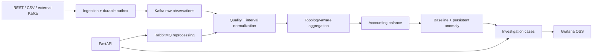

# OpenGrid Loss

Open-source smart-grid energy accounting and explainable anomaly investigations, implemented in Python with FastAPI, MySQL, Kafka, RabbitMQ and Grafana OSS.

**Deliverables:** a runnable local MVP and a [detailed production design](OPEN_GRID_LOSS_DESIGN.md). The MVP is not a claim of production certification; [implementation status](docs/implementation-status.md) and [deployment gates](docs/deployment.md) distinguish tested functionality from remaining hardening.

## Start

Windows, PowerShell 7 with Docker Desktop using Linux containers:

```powershell
./scripts/setup.ps1
docker compose up -d --build
docker compose run --rm simulator
```

Linux with Docker Compose:

```sh
sh scripts/bootstrap.sh
make simulate
```

Setup generates `.env` with random credentials. Open [Grafana](http://localhost:3000), username `admin`, password from `GRAFANA_PASSWORD` in `.env`. Open [API documentation](http://localhost:8000/docs) or [ingestion documentation](http://localhost:8001/docs). Writes require `X-API-Key` from `.env`; read requests use `READ_API_KEY` or `API_KEY`.

Open the operator UI at [http://localhost:8000/login](http://localhost:8000/login). Sign in with `UI_ADMIN_USERNAME` and `UI_ADMIN_PASSWORD` from `.env`. The setup scripts add these values to existing local `.env` files without changing any existing password.

The default demonstration creates **one transformer and five meters**, supplies 30 days of comparable evening history, and injects an 18.7% imbalance against a 7.2% normal baseline in DT-1047. The pipeline processes asynchronously; use worker health and the investigation queue to track progress. The full simulator profile generates **100 transformers and 10,000 meters**, with every interval over 90 days:

```sh
docker compose run --rm simulator python -m opengrid.simulator --profile full
```

Full mode is a large workload, not the quick-start default. Its production throughput and storage requirements have not been benchmarked. Scenario options are normal, missing-data, communication-outage, consumption-drop, transformer-imbalance and combined. Simulator output includes deterministic ground truth.

## What runs



- Six application services share one Python package; domain algorithms have no broker/database dependencies.
- Cumulative registers and interval energy have explicit separate contracts. kW is derived from interval kWh and duration.
- Decimal arithmetic, register epochs, multipliers, explicit export policy, configured rollover limits and UTC 15-minute intervals.
- Immutable raw observations, correction revisions, archived derived evidence, late-boundary recalculation and historical baseline reevaluation.
- Database-backed idempotency and transactional inbox/outbox. Kafka transports readings and derived notifications; RabbitMQ transports reprocessing commands.
- Effective-dated meter assignments, strict complete-data accounting, missing-data scheduling, median/MAD baselines and 4-of-6 persistence.
- Independent meter consumption deviations, zero/flatline observations and transformer correlation.
- Versioned case updates and audit history. Grafana case links open a small authenticated operator form; no React or commercial dashboard plugins.
- Seven provisioned dashboards and a read-only database account restricted to reporting views.

## Verify

```sh
# Unit/contract tests
docker compose run --rm test
# Real-service integration, Grafana queries and complete streaming workflow
docker compose run --rm --no-deps test pytest -q
# Lint and pure-domain type checks
docker compose run --rm --no-deps test ruff check .
docker compose run --rm --no-deps test mypy
```

The complete streaming test creates history and a persistent 20% imbalance against a 7% baseline, resubmits duplicate readings, waits for the investigation and exercises version-checked case assignment. Additional tests exercise MySQL late-register recalculation, RabbitMQ redelivery, inbox/outbox rollback, schema contracts and every Grafana panel query. Real MySQL is used; SQLite does not stand in for database integration tests.

See [validation results](docs/validation.md) for the executed checks and their limits.

## Repository

| Path | Purpose |
|---|---|
| `src/opengrid/domain.py` | Pure Decimal accounting, baseline, persistence and scoring |
| `contracts.py` | Pydantic input contracts with explicit energy semantics |
| `services.py` | Application calculations, idempotent acceptance and workflow |
| `db.py`, `schema_v1.py` | SQLAlchemy current models and frozen migration metadata |
| `api.py`, `worker.py`, `messaging.py` | Thin HTTP/broker entry points and reliable dispatch |
| `simulator.py`, `adapters.py` | Scenario generation, CSV and external Kafka adapters |
| `database/` | Alembic migrations and exported MySQL schema |
| `grafana/` | Datasource, dashboard provisioning and dashboard JSON |
| `tests/` | Domain, contract, MySQL, broker, Grafana and end-to-end tests |

Use `docker compose down` to stop while preserving data. Do not remove volumes unless you intend to erase the dataset. `make install/up/down/logs/test/lint/format/migrate/seed/simulate/clean` are provided; Windows can run the corresponding Docker commands directly.

## Documentation

[Production design](OPEN_GRID_LOSS_DESIGN.md) · [API](docs/api.md) · [Database](docs/database.md) · [Kafka](docs/kafka.md) · [Algorithms](docs/algorithms.md) · [Deployment](docs/deployment.md) · [Implementation status](docs/implementation-status.md)

MIT-licensed application code. Dependencies retain their own licenses. Contributions should follow [CONTRIBUTING.md](CONTRIBUTING.md), [SECURITY.md](SECURITY.md) and [CODE_OF_CONDUCT.md](CODE_OF_CONDUCT.md).

OpenGrid Loss converts measurements into accounting evidence and investigation candidates. Scores do not express probabilities of theft.
